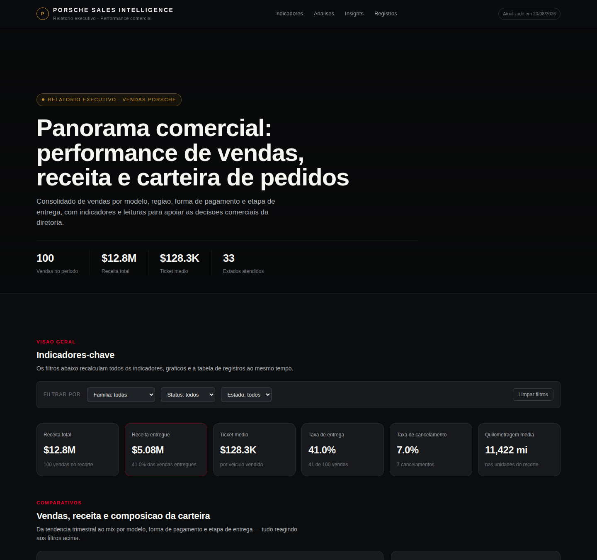

# Porsche Sales Intelligence — Relatório Executivo de Vendas

Dashboard analítico de performance comercial: indicadores, comparativos, tendências e insights para apoio à decisão da diretoria.

## Conteúdo

- **Indicadores-chave**: receita total, receita entregue, ticket médio, taxa de entrega e de cancelamento, quilometragem média.
- **Comparativos**: receita por trimestre, por família de modelo, por estado, por forma de pagamento e por vendedor; relação preço x quilometragem.
- **Funil de status de entrega**, com cor por saúde do pedido (entregue / em andamento / cancelado).
- **Insights** calculados a partir da base consolidada (portfólio, geografia, correlação, risco, pipeline, tendência).
- **Tabela interativa** com busca, ordenação por coluna e paginação.
- **Filtros globais** (família, status, estado) que recalculam todo o painel em tempo real.

## Stack

Arquivo HTML único e autocontido (`index.html`) — CSS e JavaScript vanilla, gráficos em SVG/HTML sem bibliotecas externas. Basta abrir o arquivo ou publicar via GitHub Pages.

## Identidade visual

Tema escuro, paleta preto/branco com acento vermelho e dourado, alinhada à linguagem visual da marca Porsche.

## Dados

`data/insights.json` contém os agregados de referência da análise (100 registros de venda no período).
